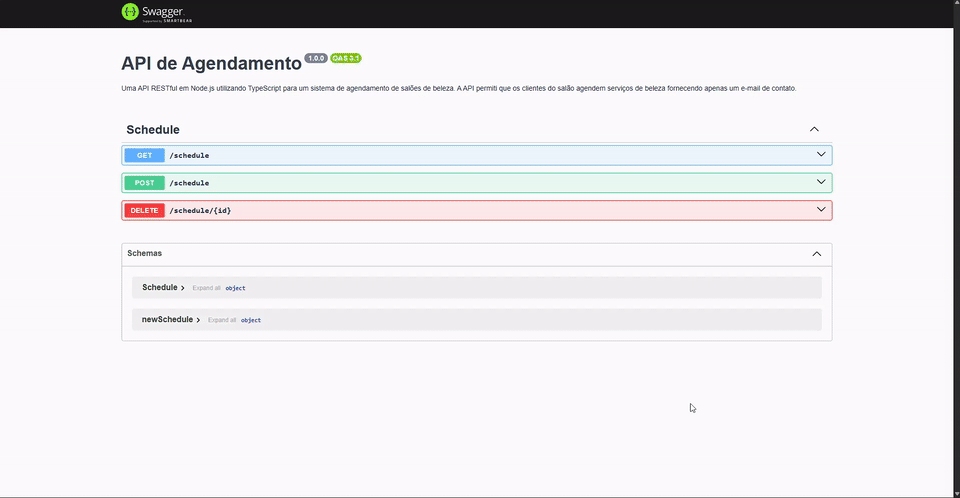
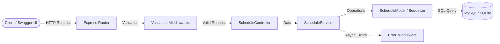

# Scheduling API - Node.js Technical Challenge 📅

[](https://nodejs.org/)
[](https://www.typescriptlang.org/)
[](https://expressjs.com/)
[](https://sequelize.org/)
[](https://www.mysql.com/)
[](https://www.docker.com/)
[](https://swagger.io/)
[](https://mochajs.org/)
[](https://opensource.org/licenses/Apache-2.0)

> 🇺🇸 **English** | 🇧🇷 [**Versão em Português**](README.md)

Robust RESTful API built with Node.js, TypeScript, and a layered MSC architecture for beauty salon scheduling management, featuring interactive documentation via Swagger UI and multi-database environment support.

## 📌 Quick Navigation

- [📝 About the Project](#-about-the-project)
- [🖼️ Preview](#️-preview)
- [🌐 Application Deployment / Live Swagger Demo](#-application-deployment--live-swagger-demo)
- [⚡ API Endpoints](#-api-endpoints)
- [✨ Features](#-features)
- [🛠️ Technologies & Tools](#️-technologies--tools)
- [🏛️ Solution Architecture](#️-solution-architecture)
- [📁 Repository Structure](#-repository-structure)
- [💡 Technical Decisions](#-technical-decisions)
- [🚀 How to Run the Project](#-how-to-run-the-project)
- [📄 License](#-license)

## 📝 About the Project

This project was built to address the backend technical challenge proposed for the company **WeDoRemotely**.

The core objective was to design and implement a scalable, performant RESTful API for beauty salon scheduling. The application adheres to solid software engineering best practices — decoupled input validation via middlewares, business logic isolation in the service layer, relational database mapping via Sequelize ORM, and comprehensive automated test coverage with test doubles (stubs/mocks).

## 🖼️ Preview

<div align="center">
  
</div>

## 🌐 Live Swagger Demo

Access the live application hosted on Render with interactive Swagger UI ready for testing:

👉 **[Node.js Challenge - Swagger Docs](https://desafio-nodejs-api.onrender.com/api-docs/)**

> ℹ️ *The root path `/` automatically redirects to the interactive Swagger UI (`/api-docs`). In this online demo environment, the API leverages a self-contained database (SQLite in-memory/file) ensuring high availability without third-party database dependencies.*

## ⚡ API Endpoints

The base URL is `http://localhost:3001` (or your live Render URL).

| Method | Endpoint | Description | Expected Status Codes |
| :--- | :--- | :--- | :--- |
| `GET` | `/` | Auto-redirects to Swagger documentation | `302 Found` |
| `GET` | `/api-docs` | Interactive OpenAPI/Swagger graphical interface | `200 OK` |
| `GET` | `/schedule` | Retrieves all registered appointments | `200 OK`, `500 Internal Server Error` |
| `POST` | `/schedule` | Creates a new appointment using a customer email | `201 Created`, `400 Bad Request`, `500 Internal Server Error` |
| `DELETE` | `/schedule/:id` | Cancels/removes an existing appointment by ID | `200 OK`, `400 Bad Request`, `404 Not Found` |

### Sample Request & Response

#### Create Appointment (`POST /schedule`)
- **Request Body:**
  ```json
  {
    "email": "customer@example.com"
  }
  ```
- **Success Response (`201 Created`):**
  ```json
  {
    "message": "Service scheduled successfully",
    "scheduleCreated": {
      "id": 4,
      "email": "customer@example.com",
      "scheduleDateTime": "2026-09-08T14:30:00.000Z"
    }
  }
  ```

#### Delete Appointment (`DELETE /schedule/:id`)
- **Success Response (`200 OK`):**
  ```json
  {
    "message": "Scheduling canceled successfully"
  }
  ```

## ✨ Features

- **Fast Appointment Booking**: Client scheduling ensuring data integrity with automated timestamp assignment.
- **Fail-Fast Input Validation**: Dedicated middleware checks email format and integer IDs before reaching the domain logic.
- **Centralized Error Handling**: Asynchronous exception handling delivering consistent, semantic HTTP responses.
- **Built-in OpenAPI 3.1 Documentation**: In-browser testing for all endpoints through Swagger UI.
- **Hybrid Database Architecture**: Full support for **MySQL** (via Docker Compose) in development/local environments and standalone **SQLite** for cloud demo deployments.
- **Automated Test Suite**: Integration and unit tests covering happy paths and edge cases using stubs and mocks.

## 🛠️ Technologies & Tools

- **Language & Platform**: [Node.js](https://nodejs.org/) with [TypeScript](https://www.typescriptlang.org/)
- **Web Framework**: [Express.js](https://expressjs.com/)
- **ORM & Databases**: [Sequelize](https://sequelize.org/), [MySQL 8.3](https://www.mysql.com/), [SQLite3](https://www.sqlite.org/)
- **API Documentation**: [Swagger UI Express](https://github.com/scottie1984/swagger-ui-express) (OpenAPI 3.1 specification)
- **Testing & Code Quality**: [Mocha](https://mochajs.org/), [Chai](https://www.chaijs.com/), [Sinon.js](https://sinonjs.org/), [NYC (Istanbul)](https://istanbul.js.org/)
- **Linting & Code Style**: [ESLint](https://eslint.org/) (Airbnb + SonarJS rules)
- **Containerization & Deployment**: [Docker](https://www.docker.com/), [Docker Compose](https://docs.docker.com/compose/), [Render](https://render.com/)

## 🏛️ Solution Architecture

The application adopts the **MSC (Model-Service-Controller)** layered architecture:



- **Router**: Dispatches HTTP paths to their respective middlewares and controllers.
- **Middlewares**: Enforce input constraints (`emailFields`, `idFields`), stopping invalid payloads early.
- **Controller**: Manages HTTP protocol concerns (parsing inputs, status codes, and formatting JSON responses).
- **Service**: Encapsulates business logic and orchestration.
- **Model**: Maps entities and handles database persistence via Sequelize.

## 📁 Repository Structure

```text
desafio-nodejs/
├── config/                  # Database configuration (MySQL / SQLite)
│   └── database.ts
├── public/                  # Static assets and documentation graphics
│   └── images/
│       └── swagger.gif
├── src/
│   ├── controllers/         # Request and response controllers
│   │   └── ScheduleController.ts
│   ├── database/            # Sequelize migrations and seeds
│   │   ├── migrations/
│   │   └── seeders/
│   ├── interfaces/          # TypeScript interfaces and contracts
│   ├── middlewares/         # Input validation middlewares
│   │   ├── ValidateId.ts
│   │   └── ValidateInputEmail.ts
│   ├── models/              # Sequelize entity models
│   │   ├── ScheduleModel.ts
│   │   └── index.ts
│   ├── routes/              # Express route declarations
│   │   └── scheduleRouter.ts
│   ├── services/            # Business domain services
│   │   └── ScheduleService.ts
│   ├── tests/               # Automated tests with Mocha, Chai and Sinon
│   │   ├── mocks/
│   │   └── ScheduleTest.ts
│   ├── utils/               # Custom error handlers and utilities
│   ├── app.ts               # Express application initialization
│   └── server.ts            # Server entry point
├── .env.example             # Environment variable template
├── docker-compose.yml       # Local MySQL container orchestration
├── render.yaml              # Render automated deployment blueprint
├── swagger.json             # OpenAPI 3.1 specification
├── tsconfig.json            # TypeScript compiler configuration
└── package.json             # Project metadata, dependencies, and scripts
```

## 💡 Technical Decisions

1. **Explicit Service Layer**:
   - Introduced a dedicated service layer to decouple business rules from HTTP controllers, simplifying testability with isolated stubs and mocks.
2. **Fail-Fast Validation with Middlewares**:
   - Validation rules (such as email syntax and numeric ID bounds) are verified in middlewares before reaching controllers, guaranteeing consistent data throughout the pipeline.
3. **Multi-Environment Persistence (MySQL + SQLite)**:
   - For local development reflecting production standards, MySQL is provisioned via Docker. To enable a zero-cost, instant live demo on Render, the system gracefully switches to SQLite when running in cloud production.
4. **Soft Delete & Auditing Perspective**:
   - While the challenge requested physical deletion (`DELETE`), in a commercial appointment system soft deletes (`paranoid: true`) represent the recommended pattern to preserve audit trails for accounting and customer retention.

## 🚀 How to Run the Project

### Prerequisites
- [Node.js](https://nodejs.org/) (v20 or higher)
- [Docker](https://www.docker.com/) & [Docker Compose](https://docs.docker.com/compose/) (optional, for local MySQL)
- [Git](https://git-scm.com/)

### 1. Clone the Repository
```bash
git clone https://github.com/ludson96/desafio-nodejs.git
cd desafio-nodejs
```

### 2. Install Dependencies
```bash
npm install
```

### 3. Set Up Environment Variables
Create your local `.env` from the example template:
```bash
cp .env.example .env
```

### 4. Start Local Database with Docker
If running MySQL locally, launch the container:
```bash
docker compose up -d
```

### 5. Run the Application in Development Mode
The command below compiles TypeScript, runs migrations/seeds, and launches the server with hot-reloading (`nodemon`):
```bash
npm run dev
```
The API will be available at `http://localhost:3001` (or your configured port).
Access Swagger docs at: `http://localhost:3001/api-docs`

### 6. Run Automated Tests
```bash
# Run test suite
npm test

# Run tests with code coverage report
npm run test:coverage
```

### 7. Code Linting
```bash
npm run lint
```

## 📄 License

This project is licensed under the [Apache 2.0](LICENSE) License. See the LICENSE file for details.

<div align="center">
  Developed by <strong>Ludson Pereira dos Santos</strong> 🚀<br />
  <a href="https://www.linkedin.com/in/ludson96/">LinkedIn</a> • <a href="https://github.com/ludson96">GitHub</a> • <a href="mailto:ludson_ps27@hotmail.com">E-mail</a>
</div>
