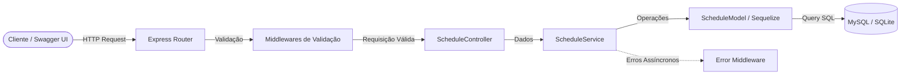

# API de Agendamento - Desafio Técnico Node.js 📅

[](https://nodejs.org/)
[](https://www.typescriptlang.org/)
[](https://expressjs.com/)
[](https://sequelize.org/)
[](https://www.mysql.com/)
[](https://www.docker.com/)
[](https://swagger.io/)
[](https://mochajs.org/)
[](https://opensource.org/licenses/Apache-2.0)

> 🇧🇷 **Português** | 🇺🇸 [**English Version**](README.en.md)

API RESTful robusta desenvolvida em Node.js com TypeScript e arquitetura em camadas (MSC) para gerenciamento de agendamentos em salões de beleza, com documentação interativa via Swagger UI e suporte a múltiplos ambientes de banco de dados.

## 📌 Navegação Rápida

- [📝 Sobre o Projeto](#-sobre-o-projeto)
- [🖼️ Preview](#️-preview)
- [🌐 Deploy da Aplicação / Demonstração Online do Swagger](#-deploy-da-aplicação--demonstração-online-do-swagger)
- [⚡ API Endpoints](#-api-endpoints)
- [✨ Funcionalidades](#-funcionalidades)
- [🛠️ Tecnologias e Ferramentas Utilizadas](#️-tecnologias-e-ferramentas-utilizadas)
- [🏛️ Arquitetura da Solução](#️-arquitetura-da-solução)
- [📁 Estrutura do Repositório](#-estrutura-do-repositório)
- [💡 Decisões Técnicas](#-decisões-técnicas)
- [🚀 Como Executar o Projeto](#-como-executar-o-projeto)
- [📄 Licença](#-licença)

## 📝 Sobre o Projeto

Este projeto foi construído para solucionar o desafio técnico de backend proposto para a empresa **WeDoRemotely**. 

O objetivo central foi projetar e implementar uma API RESTful performática e extensível para agendamento de serviços de beleza. A aplicação segue padrões sólidos de engenharia de software — validações desacopladas em middlewares, isolamento de regras na camada de serviço, suporte a banco de dados relacional via ORM (Sequelize) e cobertura de testes automatizados com mocks.

## 🖼️ Preview

<div align="center">
  
</div>

## 🌐 Demonstração Online do Swagger

Acesse a aplicação em produção hospedada no Render com o Swagger UI interativo pronto para teste:

👉 **[Desafio nodejs - Swagger Docs](https://desafio-nodejs-api.onrender.com/api-docs/)**

> ℹ️ *A rota principal `/` redireciona automaticamente para a interface interativa do Swagger (`/api-docs`). No ambiente de demonstração online, a API utiliza um banco de dados autossuficiente (SQLite em memória/arquivo) garantindo disponibilidade contínua sem depender de serviços externos.*

## ⚡ API Endpoints

A URL base da aplicação é `http://localhost:3001` (ou a URL de produção no Render).

| Método | Endpoint | Descrição | Status de Retorno |
| :--- | :--- | :--- | :--- |
| `GET` | `/` | Redirecionamento automático para a documentação Swagger | `302 Found` |
| `GET` | `/api-docs` | Interface gráfica interativa da documentação OpenAPI/Swagger | `200 OK` |
| `GET` | `/schedule` | Lista todos os agendamentos cadastrados | `200 OK`, `500 Internal Server Error` |
| `POST` | `/schedule` | Cria um novo agendamento fornecendo um e-mail | `201 Created`, `400 Bad Request`, `500 Internal Server Error` |
| `DELETE` | `/schedule/:id` | Remove/cancela um agendamento existente pelo ID | `200 OK`, `400 Bad Request`, `404 Not Found` |

### Exemplos de Requisição e Resposta

#### Criar Agendamento (`POST /schedule`)
- **Body da Requisição:**
  ```json
  {
    "email": "cliente@exemplo.com"
  }
  ```
- **Resposta de Sucesso (`201 Created`):**
  ```json
  {
    "message": "Service scheduled successfully",
    "scheduleCreated": {
      "id": 4,
      "email": "cliente@exemplo.com",
      "scheduleDateTime": "2026-09-08T14:30:00.000Z"
    }
  }
  ```

#### Deletar Agendamento (`DELETE /schedule/:id`)
- **Resposta de Sucesso (`200 OK`):**
  ```json
  {
    "message": "Scheduling canceled successfully"
  }
  ```

## ✨ Funcionalidades

- **Criação Rápida de Agendamentos**: Registro de clientes garantindo integridade de dados e geração automática de data/hora.
- **Validação Antecipada (Fail-Fast)**: Middlewares dedicados validam formato de e-mail e identificadores numéricos antes de alcançar as regras de negócio.
- **Tratamento Centralizado de Erros**: Tratamento assíncrono de exceções com respostas HTTP semânticas e consistentes.
- **Documentação OpenAPI 3.1 Integrada**: Teste interativo de todos os endpoints via Swagger UI no próprio navegador.
- **Ambientes Híbridos de Dados**: Suporte completo a **MySQL** (via Docker Compose) para desenvolvimento e testes locais, e **SQLite** para deploy de demonstração em nuvem.
- **Cobertura de Testes Automatizados**: Testes de integração e unidade cobrindo caminhos felizes e casos de borda com dublês de teste (stubs/mocks).

## 🛠️ Tecnologias e Ferramentas Utilizadas

- **Linguagem & Plataforma**: [Node.js](https://nodejs.org/) com [TypeScript](https://www.typescriptlang.org/)
- **Framework Web**: [Express.js](https://expressjs.com/)
- **ORM & Banco de Dados**: [Sequelize](https://sequelize.org/), [MySQL 8.3](https://www.mysql.com/), [SQLite3](https://www.sqlite.org/)
- **Documentação da API**: [Swagger UI Express](https://github.com/scottie1984/swagger-ui-express) (especificação OpenAPI 3.1)
- **Testes & Qualidade de Código**: [Mocha](https://mochajs.org/), [Chai](https://www.chaijs.com/), [Sinon.js](https://sinonjs.org/), [NYC (Istanbul)](https://istanbul.js.org/)
- **Padronização de Código**: [ESLint](https://eslint.org/) (configs Airbnb + SonarJS)
- **Containerização & DevOps**: [Docker](https://www.docker.com/), [Docker Compose](https://docs.docker.com/compose/), [Render](https://render.com/)

## 🏛️ Arquitetura da Solução

O projeto segue a arquitetura em camadas **MSC (Model-Service-Controller)**:



- **Router**: Mapeia as URLs e vincula os middlewares e métodos dos controllers.
- **Middlewares**: Validação estrita dos inputs (`emailFields`, `idFields`) isolando falhas de payload antes da execução de negócio.
- **Controller**: Trata apenas aspectos do protocolo HTTP (leitura de parâmetros, headers e serialização de respostas).
- **Service**: Concentra as regras de negócio da aplicação e orquestração de dados.
- **Model**: Mapeamento objeto-relacional dos esquemas de dados com Sequelize.

## 📁 Estrutura do Repositório

```text
desafio-nodejs/
├── config/                  # Configurações de banco de dados (MySQL / SQLite)
│   └── database.ts
├── public/                  # Assets estáticos e imagens para documentação
│   └── images/
│       └── swagger.gif
├── src/
│   ├── controllers/         # Camada de controle de requisições e respostas HTTP
│   │   └── ScheduleController.ts
│   ├── database/            # Migrações e seeds do Sequelize
│   │   ├── migrations/
│   │   └── seeders/
│   ├── interfaces/          # Definições de contratos e tipos TypeScript
│   ├── middlewares/         # Middlewares de validação de inputs (e-mail, ID)
│   │   ├── ValidateId.ts
│   │   └── ValidateInputEmail.ts
│   ├── models/              # Modelos Sequelize mapeando as entidades
│   │   ├── ScheduleModel.ts
│   │   └── index.ts
│   ├── routes/              # Definições de rotas da aplicação
│   │   └── scheduleRouter.ts
│   ├── services/            # Camada de regras de negócio
│   │   └── ScheduleService.ts
│   ├── tests/               # Testes automatizados com Mocha, Chai e Sinon
│   │   ├── mocks/
│   │   └── ScheduleTest.ts
│   ├── utils/               # Handlers de erro customizados e helpers
│   ├── app.ts               # Setup central da aplicação Express
│   └── server.ts            # Ponto de entrada do servidor
├── .env.example             # Modelo de variáveis de ambiente
├── docker-compose.yml       # Orquestração do MySQL local via Docker
├── render.yaml              # Blueprint de deploy automatizado no Render
├── swagger.json             # Especificação OpenAPI 3.1
├── tsconfig.json            # Configurações do compilador TypeScript
└── package.json             # Dependências e scripts do projeto
```

## 💡 Decisões Técnicas

1. **Separação em Camada Service**:
   - Foi adotada uma camada de serviço explícita para evitar colocar regras de negócio dentro de controllers, facilitando a manutenibilidade e a criação de testes unitários isolados com mocks.
2. **Validações Antecipadas por Middlewares**:
   - Inputs como e-mail e formato do ID são tratados por middlewares antes de chegarem ao controller ou service, garantindo que as camadas inferiores recebam apenas dados consistentes.
3. **Resiliência de Ambientes (MySQL + SQLite)**:
   - Para o desenvolvimento local focado em produção, o projeto usa **MySQL** via Docker Compose. Para permitir uma demonstração online gratuita e confiável no Render sem necessidade de bancos externos caros, o Sequelize adapta-se de forma inteligente ao **SQLite** em produção.
4. **Substituição de Deletar por Auditoria (Visão de Produto)**:
   - Embora o requisito básico pedisse deleção física (`DELETE`), em um sistema real de salão de beleza a boa prática seria um *soft delete* (`paranoid: true`) para manter o histórico de agendamentos para fins contábeis e de fidelização.

## 🚀 Como Executar o Projeto

### Pré-requisitos
- [Node.js](https://nodejs.org/) (v20 ou superior)
- [Docker](https://www.docker.com/) e [Docker Compose](https://docs.docker.com/compose/) (opcional, para rodar MySQL local)
- [Git](https://git-scm.com/)

### 1. Clonar o Repositório
```bash
git clone https://github.com/ludson96/desafio-nodejs.git
cd desafio-nodejs
```

### 2. Instalar Dependências
```bash
npm install
```

### 3. Configurar Variáveis de Ambiente
Copie o arquivo de exemplo e ajuste as variáveis se necessário:
```bash
cp .env.example .env
```

### 4. Inicializar o Banco de Dados com Docker
Caso vá utilizar o MySQL localmente, inicie o container:
```bash
docker compose up -d
```

### 5. Executar a Aplicação em Desenvolvimento
O comando abaixo compila o TypeScript, roda as migrações/seeds e inicia o servidor com recarregamento automático (`nodemon`):
```bash
npm run dev
```
A API estará acessível em `http://localhost:3001` (ou na porta informada no seu `.env`).
Acesse o Swagger em: `http://localhost:3001/api-docs`

### 6. Executar os Testes Automatizados
```bash
# Rodar todos os testes
npm test

# Rodar os testes gerando relatório de cobertura de código
npm run test:coverage
```

### 7. Verificação de Lint
```bash
npm run lint
```

## 📄 Licença

Este projeto está sob a licença [Apache 2.0](LICENSE). Consulte o arquivo para mais informações.

<div align="center">
  Desenvolvido por <strong>Ludson Pereira dos Santos</strong> 🚀<br />
  <a href="https://www.linkedin.com/in/ludson96/">LinkedIn</a> • <a href="https://github.com/ludson96">GitHub</a> • <a href="mailto:ludson_ps27@hotmail.com">E-mail</a>
</div>